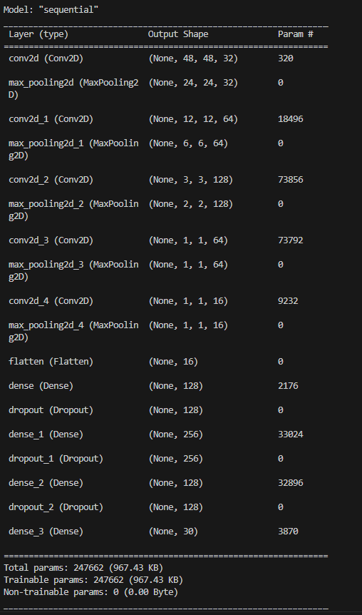

# Face Filters Using Deep Learning

These days, for any special occasion, Snapchat filters are a never-ending source of amusement. These filters give people a pleasant, visually appealing appearance when captured on camera. So, in this project we have investigated how Convolutional Neural Networks (CNN) and the OpenCV library to create filters similar to those on Snapchat.

## Dataset

The dataset is taken from kaggle.

https://www.kaggle.com/c/facial-keypoints-detection

Each predicted keypoint is specified by an (x,y) real-valued pair in the space of pixel indices. There are 15 keypoints, which represent the following elements of the face:
left_eye_center, right_eye_center, left_eye_inner_corner, left_eye_outer_corner, right_eye_inner_corner, right_eye_outer_corner, left_eyebrow_inner_end, left_eyebrow_outer_end, right_eyebrow_inner_end, right_eyebrow_outer_end, nose_tip, mouth_left_corner, mouth_right_corner, mouth_center_top_lip, mouth_center_bottom_lip
Left and right here refers to the point of view of the subject.
In some examples, some of the target keypoint positions are misssing (encoded as missing entries in the csv, i.e., with nothing between two commas).
The input image is given in the last field of the data files, and consists of a list of pixels (ordered by row), as integers in (0,255). The images are 96x96 pixels.

## How to run this project

To run this project, first you will need to install necessary libraries and then run:

```
python main.py
```

If you want to retrain the model, run:

```
python model.py
```

## Model architecture used in this project


